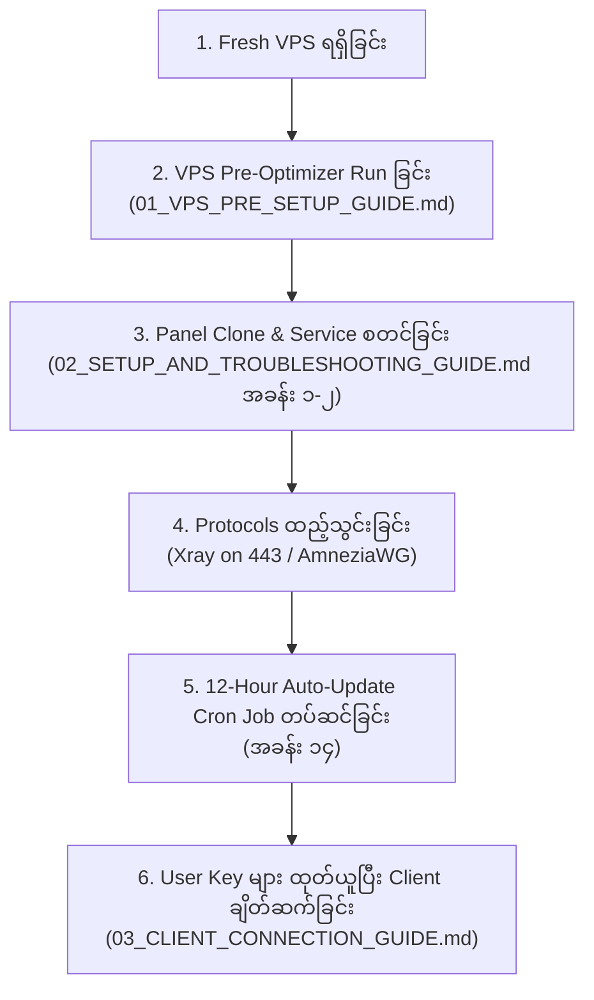

# 🇲🇲 Amnezia Web Panel - မြန်မာဘာသာ လမ်းညွှန်များ မာတိကာ (Documentation Index)

ဤ Directory (`docs_my/`) သည် **Amnezia Web Panel** အား Linux VPS ပေါ်တွင် အစမှအဆုံး တပ်ဆင်ခြင်း၊ စနစ် အကောင်းဆုံးဖြစ်အောင် ပြင်ဆင်ခြင်း၊ မြန်မာနိုင်ငံ ISP အပိတ်အပင်များကြား ချိတ်ဆက်ခြင်း၊ ဖြစ်ပေါ်တတ်သော Error များနှင့် Client App များ အသုံးပြုနည်း လမ်းညွှန်အားလုံးကို တစ်စုတစ်စည်းတည်း စုစည်းထားသော **ဗဟို မာတိကာအညွှန်း (Master Documentation Hub)** ဖြစ်ပါသည်။

---

## 📑 မာတိကာ အညွှန်း (Guides Index)

| အမှတ် | လမ်းညွှန် အမည် | ဖော်ပြချက် | ဖတ်ရှုရန် Link |
| :---: | :--- | :--- | :---: |
| **01** | **VPS Pre-Flight Checker & Auto-Optimizer** | Server အသစ်တွင် BBR, IP Forwarding, 4GB Swap (Anti-Crash), Docker Permissions နှင့် Firewall များကို One-Click ဖြင့် အလိုအလျောက် ပြင်ဆင်ပေးခြင်း | [👉 01_VPS_PRE_SETUP_GUIDE.md](01_VPS_PRE_SETUP_GUIDE.md) |
| **02** | **Setup, Management & Troubleshooting Guide** | Web Panel စတင်ထည့်သွင်းခြင်းမှသည် Systemd Service, NGINX SSL, Fork Sync, Auto-Update Cron Job နှင့် စနစ်တစ်ခုလုံး အပြီးတိုင် Uninstall လုပ်နည်းများ အပါအဝင် အခန်း (၁၄) ခန်း ပြည့်စုံ လမ်းညွှန် | [👉 02_SETUP_AND_TROUBLESHOOTING_GUIDE.md](02_SETUP_AND_TROUBLESHOOTING_GUIDE.md) |
| **03** | **Client Connection Guide (ဖုန်းနှင့် PC ချိတ်ဆက်နည်း)** | ထုတ်ယူထားသော Xray (VLESS Reality) နှင့် AmneziaWG (AWG 3.1) Keys များကို Android, iOS, Windows များတွင် v2rayNG, V2Box, Nekoray, AmneziaWG App များဖြင့် အမှားအယွင်းမရှိ ချိတ်ဆက်နည်း | [👉 03_CLIENT_CONNECTION_GUIDE.md](03_CLIENT_CONNECTION_GUIDE.md) |

---

## 🗺️ စတင်လုပ်ဆောင်ရမည့် အဆင့်ဆင့် Roadmap (Workflow)



---

## ⚡ မကြာခဏ အသုံးပြုရသော One-Click Scripts အကျဉ်းချုပ်

### ၁။ VPS Pre-Flight Checker & Optimizer (စတင်ချိန်တွင် Run ရန်):
```bash
curl -sSL https://raw.githubusercontent.com/uzinlay85/Amnezia-Web-Panel/main/scripts/vps_optimizer.sh | sudo bash
```

### ၂။ ၁၂ နာရီတစ်ကြိမ် GitHub မှ အလိုအလျောက် Update လုပ်မည့် Cron Job တပ်ဆင်ရန်:
```bash
cd ~/Amnezia-Web-Panel && sudo bash scripts/auto_update.sh --install
```

### ၃။ Universal Free Let's Encrypt SSL တပ်ဆင်ရန် (မိမိ Domain အတွက်):
```bash
curl -sSL https://raw.githubusercontent.com/uzinlay85/Amnezia-Web-Panel/main/scripts/setup_ssl.sh | sudo bash -s -- <YOUR_DOMAIN>
```

---

## 📌 လမ်းညွှန်တစ်ခုချင်းစီ၏ အသေးစိတ် အကြောင်းအရာများ

### 📘 [01_VPS_PRE_SETUP_GUIDE.md](01_VPS_PRE_SETUP_GUIDE.md)
- **Google BBR & FQ:** Packet Loss များသော မြန်မာပြည် အင်တာနက်လိုင်းများတွင် Speed မြန်ဆန်စေရန် Kernel ချိန်ညှိခြင်း။
- **IPv4/IPv6 Packet Forwarding:** VPN Traffic စီးဆင်းနိုင်စေရန် လမ်းကြောင်းဖွင့်ခြင်း။
- **4GB Swap Memory:** RAM 1GB / 2GB VPS များ OOM Crash မဖြစ်စေရန် အလိုအလျောက် Swap ဆောက်ခြင်း။
- **Docker Fix & Sudo Group:** Non-root user များ Docker ကို sudo မပါဘဲ run နိုင်စေရန် ခွင့်ပြုချက်ပေးခြင်း။
- **Safe UFW Firewall:** SSH Port (22/2213) မပိတ်မိစေဘဲ VPN Ports (80, 443, 5000, 55424) များကို အလိုအလျောက် ဖွင့်ပေးခြင်း။

---

### 📗 [02_SETUP_AND_TROUBLESHOOTING_GUIDE.md](02_SETUP_AND_TROUBLESHOOTING_GUIDE.md)
- **အခန်း ၁:** Linux VPS ပေါ်တွင် Panel စတင်တပ်ဆင်ခြင်း (Root & Non-Root)
- **အခန်း ၂:** Background Service (Systemd) အမြဲ Run နေစေရန် ပြုလုပ်ခြင်း
- **အခန်း ၃:** Docker Package Conflict ဖြေရှင်းနည်း (containerd vs docker-ce)
- **အခန်း ၄:** User Permissions & Sudoers Configuration
- **အခန်း ၅:** Panel ထဲတွင် Server အသစ် ချိတ်ဆက်ခြင်း (Password vs SSH Key)
- **အခန်း ၆:** AmneziaWG 3.1 Install လုပ်ခြင်းနှင့် Port ရွေးချယ်မှု
- **အခန်း ၇:** Client App ချိတ်ဆက်ခြင်းနှင့် အရေးကြီးသတိပြုဖွယ်များ
- **အခန်း ၈:** လက်တွေ့ စစ်ဆေးနည်းများနှင့် Troubleshooting Commands
- **အခန်း ၉:** NGINX Web Server နှင့် Free SSL တပ်ဆင်နည်း
- **အခန်း ၁၀:** Web Panel အား HTTPS SSL (`https://<DOMAIN>:5000`) ဖွင့်လှစ်ခြင်း
- **အခန်း ၁၁:** VPN Config များတွင် IP အစား Domain Name ဖြင့် ထွက်ရှိစေနည်း
- **အခန်း ၁၂:** စနစ်တစ်ခုလုံးကို အပြီးတိုင် Uninstall / Remove ပြုလုပ်နည်း
- **အခန်း ၁၃:** Fork Repo တွင် မူရင်း Update ရော ကိုယ်ပိုင် Custom Features ပါ မပျက်စီးစေဘဲ Sync လုပ်နည်း
- **အခန်း ၁၄:** ၁၂ နာရီတစ်ကြိမ် GitHub မှ အလိုအလျောက် Update ပြုလုပ်ရန် Cron Job တပ်ဆင်နည်း

---

### 📙 [03_CLIENT_CONNECTION_GUIDE.md](03_CLIENT_CONNECTION_GUIDE.md)
- **Xray (VLESS Reality on 443):** မြန်မာပြည် ISP များ လုံးဝ ပိတ်မရအောင် Yahoo/Microsoft အဖြစ် ဟန်ဆောင်ထားသော Key အသုံးပြုနည်း။
  - Android (v2rayNG / NekoBox)
  - iOS / iPhone (V2Box / FoXray / Streisand)
  - Windows PC (Nekoray / v2rayN)
- **AmneziaWG (AWG 3.1):** Junk Packet Obfuscation ပါဝင်သော Official AmneziaWG App အသုံးပြုနည်း။
- **Troubleshooting:** Endpoint Domain vs Raw IP ပြောင်းနည်း၊ Flight Mode Reset ပြုလုပ်နည်းနှင့် အဝိုင်းလည်နေပါက ဖြေရှင်းနည်းများ။

---
*Created with ❤️ for Amnezia & Myanmar Internet Freedom.*
